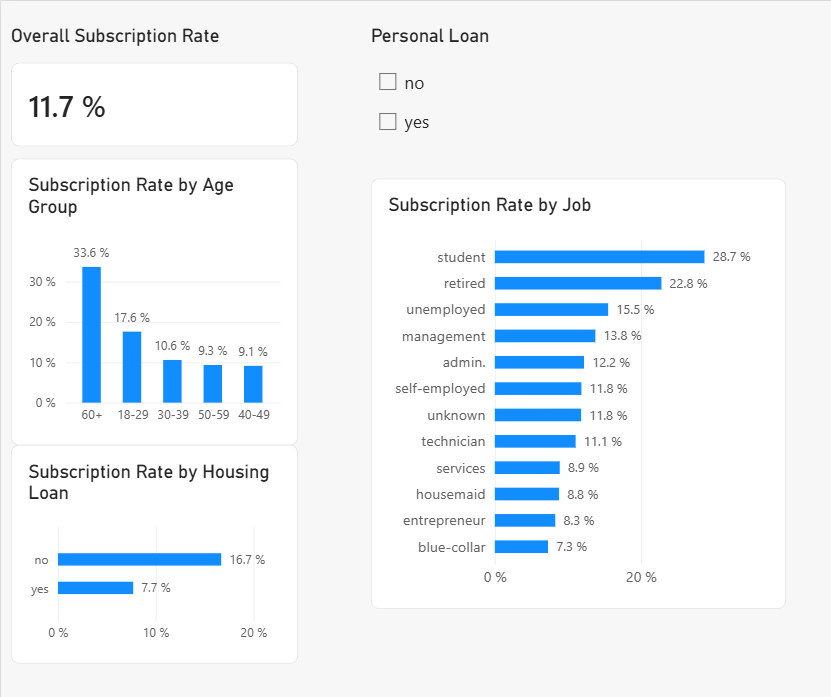

# Bank Marketing Customer Analysis

## Project Overview

This project analyses a direct marketing campaign conducted by a Portuguese banking institution to understand which customer characteristics were associated with higher term-deposit subscription rates.

The objective was to explore the campaign data, identify customer segments showing stronger subscription behaviour, and translate the findings into practical insights that could support future marketing segmentation.

The project combines data cleaning and exploratory analysis in Google Sheets with dashboard development in Power BI.

---

## Business Question

**Which customer characteristics are associated with higher term-deposit subscription rates, and which customer segments could be considered for future marketing campaigns?**

---

## Dataset

The analysis uses the **Bank Marketing dataset** from the UCI Machine Learning Repository.

The dataset contains:

- **45,211 customer records**
- **17 original variables**
- Customer demographic information
- Account and loan information
- Previous marketing contact information
- Campaign information
- `y`: whether the customer subscribed to a term deposit (`yes` / `no`)

An additional `age_group` variable was created during the analysis, resulting in **18 variables in the cleaned dataset**.

### Source

UCI Machine Learning Repository — Bank Marketing Dataset

Dataset creators: S. Moro, P. Rita and P. Cortez.

DOI: 10.24432/C5K306

License: CC BY 4.0

---

## Data Preparation and Quality Checks

Before analysing the campaign, I performed a data-quality review.

The process included:

- Checking for exact duplicate records
- Checking all variables for blank/missing cells
- Reviewing numerical ranges using minimum and maximum values
- Reviewing categorical variables for inconsistent spelling, capitalisation or formatting
- Identifying `unknown` values and retaining them as recorded categories rather than treating them as blank cells
- Reviewing unusual numerical values and retaining them where there was no evidence that they were data-entry errors

### Results

- **45,211 unique records remained**
- **No exact duplicate rows were identified**
- **No blank values were identified across the original 17 variables**
- Existing `unknown` categories were retained
- Numerical outliers were not automatically removed because unusual values are not necessarily erroneous values

A derived variable called `age_group` was created to make age-based customer segmentation easier:

- 18–29
- 30–39
- 40–49
- 50–59
- 60+

Power Query was also used during the Power BI workflow to verify the imported dataset and remove unnecessary columns created during earlier audit work.

---

## Analysis Approach

The exploratory analysis focused on both absolute customer counts and subscription rates.

Subscription rate was particularly important because customer groups have different sizes. Comparing percentages therefore provides more useful information about subscription behaviour within each segment than comparing subscriber counts alone.

The analysis explored:

- Overall campaign subscription rate
- Subscription rate by age group
- Subscription rate by occupation
- Personal-loan status
- Housing-loan status
- Average account balance
- Selected combinations of customer characteristics

Pivot tables were used during the exploratory analysis, followed by Power BI visualisations for presenting the main findings.

---

## Key Findings

### 1. Overall campaign performance

Out of **45,211 customers**, **5,289 subscribed** to the term deposit.

**Overall subscription rate: 11.7%**

This means that fewer than 12% of customers contacted during the campaign subscribed.

### 2. Age showed substantial differences

Customers aged **60+ had the highest subscription rate at 33.6%**, almost three times the overall campaign rate.

Customers aged **18–29 also performed above average at 17.6%**.

Other age groups showed lower subscription rates:

| Age Group | Subscription Rate |
|---|---:|
| 60+ | 33.6% |
| 18–29 | 17.6% |
| 30–39 | 10.6% |
| 50–59 | 9.3% |
| 40–49 | 9.1% |

### 3. Students and retired customers showed strong subscription rates

The highest subscription rates by occupation included:

| Job | Subscription Rate |
|---|---:|
| Student | 28.7% |
| Retired | 22.8% |
| Unemployed | 15.5% |
| Management | 13.8% |
| Admin | 12.2% |

This demonstrates why subscription rate should be considered alongside customer volume: a smaller customer group can show stronger subscription behaviour even if it produces fewer subscriptions in absolute numbers.

### 4. Customers without existing loans performed better

Customers without a **housing loan** had a subscription rate of approximately **16.7%**, compared with **7.7%** among customers with a housing loan.

For personal loans:

- No personal loan: **12.7%**
- Personal loan: **6.7%**

Customers without these existing loan commitments therefore showed higher subscription rates in this dataset.

### 5. Subscribers had higher average account balances

Average account balance was approximately:

- **Subscribed customers: 1,804**
- **Non-subscribed customers: 1,304**

Higher balances were therefore associated with term-deposit subscription in this dataset.

### 6. Further investigation of customers aged 60+

Because customers aged 60+ showed particularly high subscription rates, this segment was investigated further by occupation.

Among customers aged 60+, some occupational groups showed particularly high rates, including:

- Self-employed: **46.3%**
- Retired: **37.6%**

These percentages should be interpreted alongside the underlying group sizes before being used to make targeting decisions.

---

## Business Recommendations

Based on the exploratory analysis, the bank could consider:

1. Giving greater attention to customer segments that showed above-average subscription rates, particularly customers aged 60+, students and retired customers.
2. Considering existing loan commitments when developing customer segmentation, as customers without personal or housing loans showed higher subscription rates.
3. Exploring account balance as an additional segmentation signal, since subscribers had higher average balances.
4. Combining multiple customer characteristics rather than relying on a single variable when identifying potential campaign audiences.
5. Testing these segments through future campaigns before making broader targeting decisions.

---

## Power BI Dashboard

A Power BI dashboard was created to communicate the principal findings visually.

The dashboard includes:

- Overall subscription-rate KPI
- Subscription rate by age group
- Subscription rate by occupation
- Subscription rate by housing-loan status
- Interactive personal-loan filtering

Power Query was used as part of the data preparation workflow, while a reusable DAX measure was created to calculate subscription rates dynamically across customer segments.



---

## Tools and Skills Demonstrated

**Google Sheets / Excel**
- Data-quality checks
- Duplicate and missing-value checks
- Pivot tables
- Conditional formulas
- Percentage and rate calculations
- Customer segmentation
- Exploratory data analysis

**Power BI**
- CSV data import
- Power Query
- Data-type validation
- Data transformation
- DAX measures
- KPI cards
- Bar and column charts
- Slicers and interactive filtering
- Dashboard development

**Analytical Skills**
- Translating a business question into an analysis
- Comparing counts versus rates
- Customer segmentation
- Considering group size when interpreting percentages
- Identifying patterns and translating them into business recommendations

---

## Limitations

This project is exploratory and the findings represent **associations rather than causal relationships**.

A higher subscription rate within a customer segment does not demonstrate that the characteristic itself caused customers to subscribe.

Additional considerations include:

- Segment size should be considered alongside subscription rates.
- `unknown` categories are present in several variables.
- Extreme numerical values were retained unless there was evidence that they were erroneous.
- Further statistical analysis would be required to assess the strength and reliability of relationships between variables.
- Future predictive modelling could investigate which combination of characteristics best predicts term-deposit subscription.

---

## Repository Structure

```text
bank-marketing-customer-analysis/
│
├── README.md
│
├── data/
│   └── bank-clean.csv
│
├── power-bi/
│   └── Bank-Marketing-Analysis.pbix
│
└── images/
    └── bank-marketing-dashboard.png
